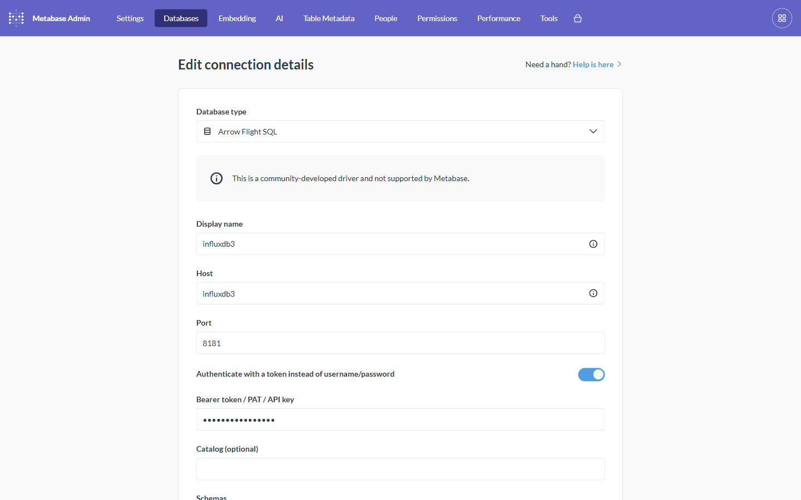

# Tutorial: Authentication cookbook

**Backends:** all · **Level:** reference · **Time:** ~5 min per mode

## Problem

Flight SQL servers authenticate in wildly different ways — username/password,
API keys, bearer tokens, external JWTs, mTLS, OAuth 2.0, or nothing at all. This
driver covers all of them through **one connection form**, with a single toggle
that flips between the two families.

## The one toggle

**"Authenticate with a token instead of username/password"** is the pivot:

- **Off** → username/password family (also API-key and external-JWT conventions).
- **On** → a single **Bearer token / PAT / API key** sent as `Authorization: Bearer …`.

**Username/password (toggle off):**

**Bearer token (toggle on):**

## Every mode, and how to set it

| Mode | Toggle | Username | Password | Other | Backends |
|---|---|---|---|---|---|
| **Username / password** | off | your user | your password | — | GizmoSQL, Dremio, Doris/StarRocks, Denodo |
| **Username + empty password** | off | `root` | *(empty)* | — | Doris/StarRocks `root` |
| **Spice API key** | off | *(blank)* | the API key | — | Spice.ai |
| **External JWT** (handshake) | off | `token` (literal) | the JWT | — | GizmoSQL Core |
| **Bearer / PAT / API key** | **on** | — | — | Token field | InfluxDB 3, Dremio PAT (Enterprise), any pre-issued bearer |
| **Anonymous** | off | *(blank)* | *(blank)* | — | Spice (no auth), ROAPI, kamu, Ballista |
| **mTLS** | off/either | (as needed) | (as needed) | client cert + key (Advanced) | GizmoSQL (TLS profile) |
| **OAuth 2.0 client-credentials** | off | — | — | `oauth.*` in Additional options | GizmoSQL |

## Notes per mode

- **Spice API key** rides as the *password* with a **blank username** — Spice's
  convention. Anonymous Spice (`spiced-anon`) takes no credentials at all.
- **GizmoSQL external JWT**: set Username to the literal `token` and put the JWT
  in Password (a Flight *handshake* convention). GizmoSQL **Core** does **not**
  accept a raw `Authorization: Bearer` header (the token toggle) — that's an
  Enterprise/JWKS capability. Use the `token`-username handshake instead.
- **Dremio PAT** is Enterprise-only; on Dremio **OSS** use username/password.
- **mTLS**: enable TLS, then add the client **certificate** and **key** (PEM
  secrets) under Advanced; add the server CA if it's not publicly trusted.
- **OAuth 2.0**: put the Arrow JDBC `oauth.*` client-credentials/token-exchange
  parameters in **Additional options**; the driver fetches and attaches the token.

## Advanced / transport options

Under **Advanced options**:

- **Use a secure connection (TLS)** + optional **server CA certificate** and
  **skip certificate verification** (for self-signed demo certs like quack).
- **Additional options** — free-form JDBC params. Unknown params are forwarded to
  the server as **gRPC headers** (e.g. `database=demo` for InfluxDB 3,
  `tenant=acme` for quack), plus `threadPoolSize`, `retainAuth`, connect timeout, etc.

## How it works

The driver reads the toggle and the fields, then builds the Flight SQL JDBC URL:
a bearer token becomes `authorization=Bearer …`; username/password become a
Flight handshake (basic auth); a blank username with a password is the Spice
API-key shape; nothing configured is anonymous. Legacy connections are detected
and the toggle is backfilled on read, so upgrades keep working.

## Related

- Backend references (each lists its exact auth): [Dremio](../backends/dremio.md) ·
  [Spice.ai](../backends/spice.md) · [GizmoSQL](../backends/gizmosql.md) ·
  [InfluxDB 3](../backends/influxdb3.md) · [quack](../backends/quack.md) ·
  [Doris/StarRocks](../backends/doris-starrocks.md)
- e2e coverage: [test_config_matrix.py](../../tests/e2e/test_config_matrix.py),
  [test_tls.py](../../tests/e2e/test_tls.py), [test_oauth.py](../../tests/e2e/test_oauth.py)
