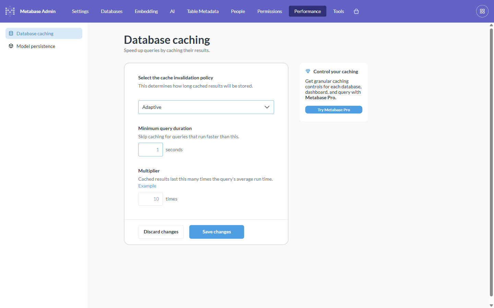

# Tutorial: Caching & query acceleration

**Backend:** Spice.ai · **Level:** intro · **Time:** ~10 min

## Problem

Your dashboards hammer a slow or expensive source (a remote Postgres, an object
store, an API). You want fast, cheap reads without re-querying the source every
time. **This is the driver's original reason for existing** — put **Spice.ai** in
front of the slow source as an *acceleration* (cache) layer, and point Metabase
at Spice.

There are two complementary layers:

1. **Spice acceleration** — Spice materializes upstream data into a fast local
   store (in-memory / DuckDB / SQLite) and refreshes it on a schedule. Metabase's
   queries hit the accelerated copy, not the slow origin.
2. **Metabase result cache** — Metabase can also cache *query results* so repeat
   runs skip execution entirely.

## When to use this

- A source that's slow, rate-limited, or costly to query repeatedly.
- Dashboards refreshed by many users where the underlying data changes on a known
  cadence.

## What you'll build

A Spice dataset with acceleration enabled, connected to Metabase, plus a Metabase
caching policy so repeated queries are instant.

## Prerequisites

The base stack (Spice is part of it), Metabase at http://localhost:3000. See
[backends/spice](../backends/spice.md).

---

## Step 1 — Accelerate a dataset in Spice

In `spice/spicepod.yaml`, add `acceleration` to a dataset. Spice keeps a fast
local copy and refreshes it on the interval you set:

```yaml
datasets:
  - name: yellow_taxis
    from: file://data/yellow_tripdata_2024-01.parquet   # or postgres:, s3:, databricks:, …
    params:
      file_format: parquet
    acceleration:
      enabled: true
      engine: duckdb          # in-memory | duckdb | sqlite
      refresh_mode: full
      refresh_check_interval: 10m
```

Restart Spice (`podman-compose up -d spiced`). Queries now read the accelerated
copy; the slow origin is touched only on refresh.

## Step 2 — Point Metabase at Spice

Add an **Arrow Flight SQL** database: host `spiced-container`, port `50051`,
leave username blank, password = the API key. Metabase now queries the fast Spice
layer through the driver (see the [Spice backend reference](../backends/spice.md)).

## Step 3 — Add Metabase's result cache

For an extra layer, cache the *results* too. In **Admin → Performance → Database
caching**, set the invalidation policy to **Adaptive** (it uses each query's
average execution time to decide how long to keep results):



Now a repeated question returns from cache without re-executing — you'll see it
resolve instantly and the question's info panel notes it was served from cache.

---

## How it works

```
slow source ──▶ Spice (accelerated copy, scheduled refresh) ──(arrow-flight-sql)──▶ Metabase ──▶ result cache
   origin              layer 1: data cache                         driver                 layer 2: result cache
```

Spice absorbs the cost of reading the origin and serves a fast columnar copy over
Flight SQL; Metabase optionally caches the *results* of the questions it runs on
top. The driver is the pipe between them.

## Variations & gotchas

- **Refresh trade-off.** Shorter `refresh_check_interval` = fresher data, more
  load on the origin. Match it to how often the source actually changes.
- **`refresh_mode`.** `full` reloads everything; `append` adds new rows; some
  connectors support CDC for near-real-time (see [realtime-analytics](realtime-analytics.md)).
- **Two caches, two lifetimes.** Spice's refresh controls data freshness;
  Metabase's policy controls result reuse. A stale Metabase cache can outlive a
  Spice refresh — keep the Metabase TTL ≤ the Spice refresh interval for
  freshness-sensitive dashboards.
- **Granular per-question caching** (different TTLs per dashboard/query) is a
  Metabase Pro feature; OSS has the single global policy shown above.

## Related

- Backend reference: [Spice.ai](../backends/spice.md)
- [Real-time analytics / CDC](realtime-analytics.md)
- [Federation / semantic layer](federation-semantic-layer.md)
