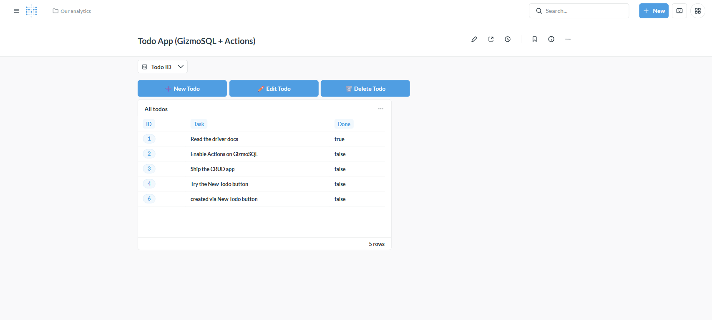
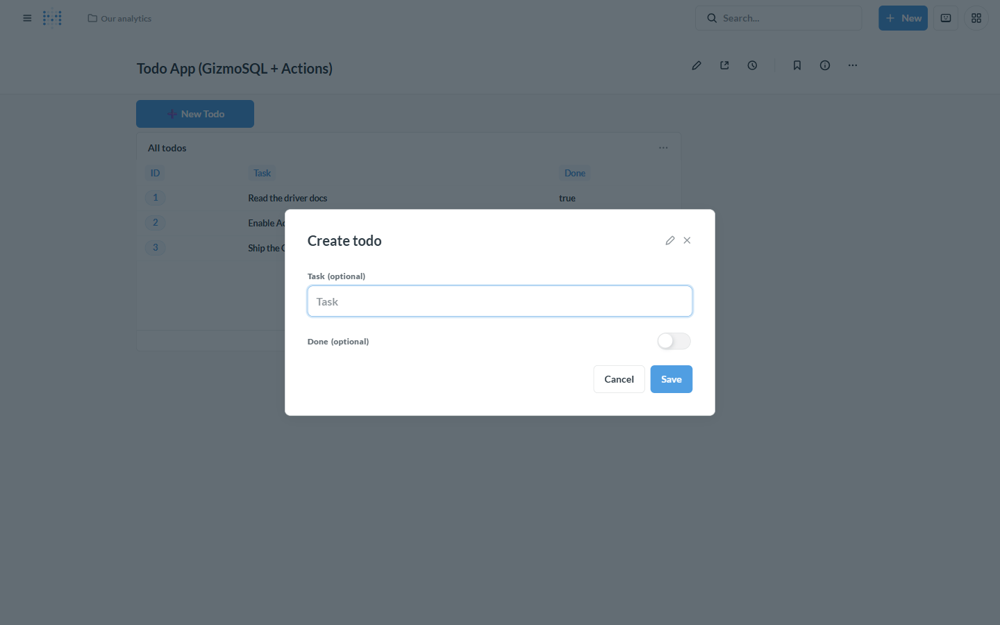
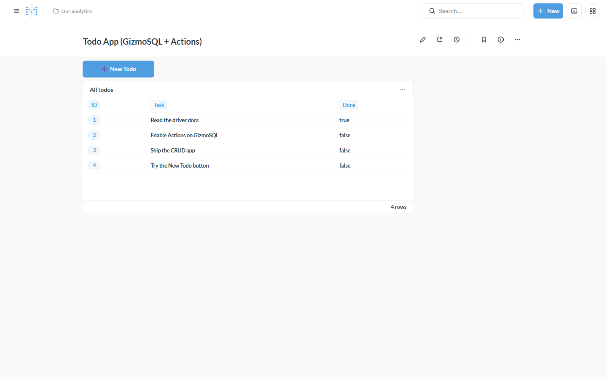
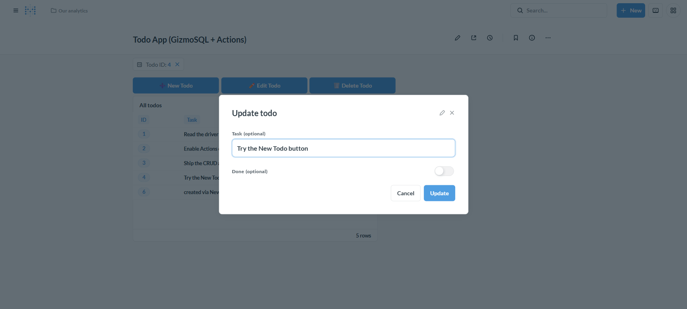

# Tutorial: A full-CRUD app on your data (Actions)

**Backend:** GizmoSQL (DuckDB) · **Also works with:** Dremio, Doris/StarRocks ·
**Level:** intermediate · **Time:** ~20 min

## Problem

You want a small internal app — a to-do list, an approvals queue, a lookup-table
editor — where people **create, edit, and delete rows** from a Metabase
dashboard, no separate app framework. Metabase **Actions** do exactly this:
buttons and forms that write back to your database. Through this driver they work
on writable, full-DML Flight SQL backends.

By the end you'll have a **Todo app** dashboard with **Create / Edit / Delete**
wired to the table — click a row, edit it, done.



## When to use this

- Simple internal CRUD over a table (todos, statuses, config/lookup tables).
- Data-entry or correction workflows next to your analytics.
- You want write-back **buttons/forms**, not just SQL.

> **Backend must support full DML.** GizmoSQL/DuckDB, [Dremio](../backends/dremio.md)
> (Iceberg), and [Doris/StarRocks](../backends/doris-starrocks.md) qualify.
> **Spice is INSERT-only**, so edit/delete actions won't work there — see
> [write-back / actions](writeback-actions.md).

## Prerequisites

The base stack with a **GizmoSQL** connection ([backends/gizmosql](../backends/gizmosql.md)),
Metabase at http://localhost:3000.

---

## Step 1 — Enable Actions on the connection

Two switches (Actions write to your database, so they're deliberately opt-in):

1. **Connection:** Admin → Databases → gizmo → *Edit connection details* →
   *Advanced options* → turn on **Writable backend** and **Enable Actions
   (write-back buttons & forms)**.
2. **Database:** Admin → Databases → gizmo → *Turn on actions for this database*
   (the `database-enable-actions` setting).

## Step 2 — A table with an auto-increment PK

Actions target rows by **primary key**, and *create* forms expect the PK to be
auto-generated. In a native SQL cell:

```sql
CREATE SEQUENCE main.seq_todos START 1;
CREATE TABLE main.todos (
  id   INTEGER PRIMARY KEY DEFAULT nextval('main.seq_todos'),
  task VARCHAR,
  done BOOLEAN DEFAULT false
);
```

Sync the database, then in **Admin → Table Metadata → todos** set the `id`
field's type to **Entity Key**. (PK auto-detection varies across Flight SQL
backends, so this driver has you mark it — a one-time step per table.)

## Step 3 — Create a model + its actions

Turn the table into a **model** (New → Model → pick `main.todos`). A model that
wraps a single table automatically gets **basic actions** — *create*, *update*,
and *delete* — plus you can add **custom SQL actions** for bespoke writes.

## Step 4 — Build the dashboard

Create a dashboard and, in **edit mode**, assemble four things:

1. **The table.** Add the todos question (a plain table of the model).
2. **A "Todo ID" filter.** *Add a filter → Number → Equal to*, name it **Todo
   ID**. This is how Edit/Delete know *which* row to act on.
3. **Three action buttons.** *Add → Action* three times:
   | Button | Action | Label |
   |---|---|---|
   | Create | model's **Create** | `➕ New Todo` |
   | Update | model's **Update** | `✏️ Edit Todo` |
   | Delete | model's **Delete** | `🗑️ Delete Todo` |
4. **Map the row-scoped actions to the filter.** On **Edit Todo** and **Delete
   Todo**, map the action's **`id`** parameter to the **Todo ID** dashboard
   filter (so `id` comes from the filter, not typed by hand). Leave `task` /
   `done` to be entered in the form.

### Wire row-clicks to the filter (so clicking a row targets it)

Still in edit mode, click the table card's **behavior** (the ✎/click-behavior
gear) → **Update a dashboard filter** → set **Todo ID = column `id`**. Now
**clicking any row sets the Todo ID filter to that row's id** — Edit/Delete then
operate on the row you clicked. Save the dashboard.

> This is the "row → action" wiring: Metabase dashboards don't run an action
> straight from a row click, but a row click *sets the filter*, and the mapped
> Edit/Delete buttons act on it. Create isn't row-scoped (it makes a new row), so
> it needs no filter.

## Step 5 — Use it

**Create.** Click **➕ New Todo** → a form built from the model's columns (the PK
`id` is omitted — it auto-generates):



Type a task, **Save**, and the `INSERT` runs on GizmoSQL through the driver:



**Edit.** Click a **row** (the Todo ID filter fills with its id), then **✏️ Edit
Todo**. The form opens **pre-filled with that row's current values** — change
what you want and **Update**:



**Delete.** Click a **row**, then **🗑️ Delete Todo** → confirm. The `DELETE` runs
and the table refreshes.

That's full CRUD — Create, Read, Update, Delete — from one dashboard.

---

## How it works

```
click row ─▶ sets "Todo ID" filter ─┐
                                     ├─▶ ✏️ Edit  ─▶ UPDATE ─┐
➕ New ─▶ CREATE ────────────────────┤   🗑️ Delete ─▶ DELETE ─┼▶ arrow-flight-sql ─▶ GizmoSQL
                                     └────────────────────────┘        driver
```

The driver advertises the `:actions` / `:actions/custom` features (gated on the
Enable-Actions toggle) and reuses Metabase's `perform-action!*` machinery, with a
few Flight-SQL-specific pieces (autocommit "transactions", value casting, and an
inline row-lookup after insert since Flight SQL returns an update count, not
generated keys). Basic create/update/delete **and** custom SQL actions are
covered end-to-end by [test_actions.py](../../tests/e2e/test_actions.py).

## Variations & gotchas

- **Full-DML backends only.** Spice is INSERT-only (no edit/delete). InfluxDB 3
  and read-only sources don't advertise actions at all.
- **Mark the PK** (Entity Key) — required for basic actions; auto-detection
  varies across backends so it's a manual step here.
- **Auto-increment the PK** (a sequence/identity) so *create* can omit it.
- **Update/Delete need the `id`.** The Todo ID filter (fed by the row click)
  supplies it; without a filter value the buttons have no row to act on.
- **Custom SQL actions** handle writes the basic actions don't — any
  parameterized `INSERT/UPDATE/DELETE` with `{{template-tags}}`.
- **Permissions.** Creating/running actions is admin-gated; restrict write access
  with Metabase permissions + the backend's own RBAC.
- Basic Actions need a model that wraps a **single** table.

## Related

- [Write-back to your lakehouse](writeback-actions.md) — SQL-level writes (incl. Spice INSERT)
- [Transformations inside Metabase](transformations-in-metabase.md) · Backend: [GizmoSQL](../backends/gizmosql.md)
