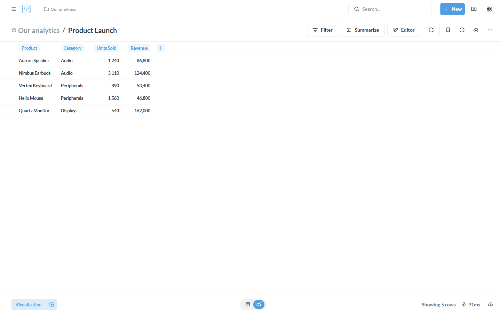
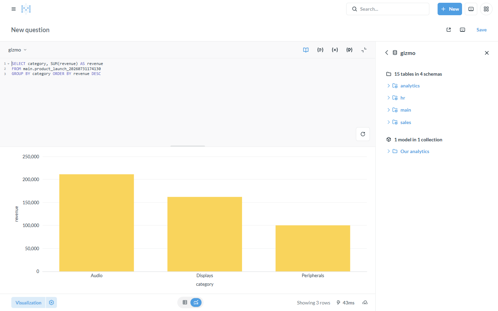

# Tutorial: CSV uploads → a typed model

**Backend:** GizmoSQL (DuckDB) · **Also works with:** Dremio, Doris/StarRocks ·
**Level:** intro · **Time:** ~5 min

## Problem

Someone hands you a spreadsheet and you want to explore it in Metabase — join it
to existing data, chart it, share it — without asking a data engineer to load it.
Metabase's **CSV upload** does this by creating a **real, typed table** on a
*writable* Flight SQL backend, plus a model to query it.

## When to use this

- Ad-hoc data (a CSV/TSV export) you want to analyze alongside your warehouse.
- You want the upload to become a genuine warehouse table (not a throwaway), so
  it can be joined, transformed, and dashboarded.

> Uploads **write** to your database, so they need a *writable* backend — the
> same **Writable backend** toggle as [transformations](transformations-in-metabase.md).
> GizmoSQL/DuckDB, Dremio, and Doris qualify; read-only backends reject uploads.

## What you'll build

Upload a small `product_launch.csv`, get a typed **Product Launch** model, and
chart revenue by category from the resulting table.

## Prerequisites

The base stack with a **GizmoSQL** connection ([backends/gizmosql](../backends/gizmosql.md)),
Metabase at http://localhost:3000.

---

## Step 1 — Turn on uploads

Two switches:

1. **Per connection:** Admin → Databases → gizmo → *Edit connection details* →
   turn on **"Writable backend (enable CSV uploads)"**.
2. **Site setting:** Admin → Settings → **Uploads** → enable, then choose the
   **database** (gizmo) and **schema** (`main`) where uploads land.

## Step 2 — Upload the CSV

In any collection, use **Upload data** (or drag the file onto the collection).
Pick a CSV like:

```csv
product,category,units_sold,revenue
Aurora Speaker,Audio,1240,86800
Nimbus Earbuds,Audio,3110,124400
Vertex Keyboard,Peripherals,890,53400
Helix Mouse,Peripherals,1560,46800
Quartz Monitor,Displays,540,162000
```

Metabase infers column types, creates a table in `gizmo.main`, and opens a
**model** over it — `units_sold` and `revenue` come through as numbers:



## Step 3 — It's a real table — query it

The upload isn't a snapshot; it's a table on GizmoSQL. Query and aggregate it
like any other — here, revenue by category (note gizmo now lists an extra table
in `main` and the new model):

```sql
SELECT category, SUM(revenue) AS revenue
FROM main.product_launch_<timestamp>
GROUP BY category ORDER BY revenue DESC
```



From here you can append more rows (upload again to the same table), join it to
`sales.orders`, or feed it into a [transform](transformations-in-metabase.md).

---

## How it works

```
CSV ──▶ Metabase Upload ──(CREATE TABLE + INSERT via arrow-flight-sql)──▶ typed table + model
```

Metabase parses the CSV, infers types, and issues DDL/DML over the driver to
create and populate a table on the backend, then wraps it in a model. Because it
writes, it's gated by the connection's **writable** flag.

## Variations & gotchas

- **Append vs replace.** Uploading again can append to (or replace) an existing
  uploaded table from the table's menu.
- **Where it lands.** The upload database/schema is the site-wide **Uploads**
  setting (here `gizmo` / `main`); the table name gets a timestamp suffix.
- **Writable backends only.** GizmoSQL/DuckDB, [Dremio](../backends/dremio.md)
  (the uploaded table is Iceberg), [Doris/StarRocks](../backends/doris-starrocks.md).
  Read-only backends (Spice datasets, InfluxDB 3) reject uploads with a clean error.
- Covered by the e2e suite: [test_uploads.py](../../tests/e2e/test_uploads.py).

## Related

- [Transformations inside Metabase](transformations-in-metabase.md) — the sibling writable feature
- Backend reference: [GizmoSQL](../backends/gizmosql.md)
