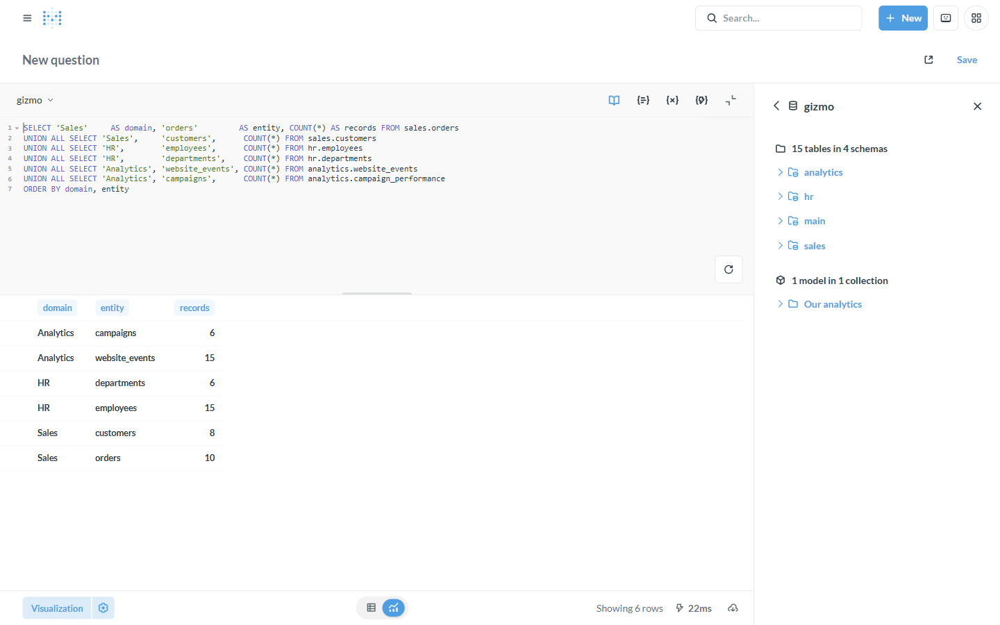

# Tutorial: Federation & a semantic layer

**Backend:** Dremio or Spice.ai · **Level:** intermediate · **Time:** ~10 min

## Problem

Your data lives in many places — Postgres, S3/Parquet, Iceberg, MySQL, a data
warehouse — and you don't want a Metabase connection per source, nor to move
everything into one warehouse first. Put a **federation engine** (Dremio or
Spice.ai) in front, and Metabase sees **one database** that spans them all,
through this driver.

## When to use this

- Data spread across multiple systems you want to query and join together.
- You want a **semantic layer** — governed, reusable datasets/metrics — over
  heterogeneous sources, exposed to Metabase as clean tables.
- You want query pushdown to each source instead of extracting everything.

## What you'll build

One Metabase connection whose namespaces come from different sources, and a query
that reaches across them.

## Prerequisites

The base stack; a **Dremio** ([backends/dremio](../backends/dremio.md)) or
**Spice.ai** ([backends/spice](../backends/spice.md)) connection. Metabase at
http://localhost:3000.

---

## Step 1 — Register multiple sources in the engine

The engine is where federation happens. In **Spice** (`spicepod.yaml`), each
catalog/dataset can come from a different connector:

```yaml
catalogs:
  - from: iceberg:http://catalog:8181/v1/namespaces   # lakehouse
    name: lake
datasets:
  - name: crm.customers
    from: postgres:public.customers                    # operational DB
    params: { pg_host: crm-db, pg_user: readonly, ... }
  - name: events.web
    from: s3://bucket/events/                           # object storage
    params: { file_format: parquet }
```

In **Dremio**, you add each system (NAS, S3, RDBMS, Iceberg…) as a *source*; its
tables appear under that source's namespace. Either way, the engine presents them
through one Arrow Flight SQL endpoint.

## Step 2 — Connect Metabase once

Add a single **Arrow Flight SQL** database pointing at the engine. Every source's
tables show up as **schemas** under that one connection — no per-source setup in
Metabase.

## Step 3 — Query across sources

Now a single query reaches across namespaces that (in production) are different
physical systems. Here, one connection spans the `sales`, `hr`, and `analytics`
domains at once:

```sql
SELECT 'Sales' AS domain, 'orders' AS entity, COUNT(*) AS records FROM sales.orders
UNION ALL SELECT 'HR',        'employees', COUNT(*) FROM hr.employees
UNION ALL SELECT 'Analytics', 'website_events', COUNT(*) FROM analytics.website_events
-- …and join across them: sales.customers ⋈ analytics.website_events, etc.
```



The engine plans the query, **pushes filters/joins down** to each source, and
returns a single result set — Metabase never knows the data was federated.

## Step 4 — Add a semantic layer

Turn raw federated tables into a **governed** layer your users can trust:

- **Models** (Metabase) — curated, documented datasets built on the federated
  tables; rename columns, join once, hide the messy bits.
- **Metrics** — official definitions (e.g. "Active revenue") reused across
  questions and dashboards.
- In the engine — Dremio **views/reflections** or Spice **views** pre-shape and
  accelerate common queries before Metabase even sees them.

---

## How it works

```
Postgres ┐
S3/Parquet├─▶ Dremio / Spice (federation + semantic layer) ──(arrow-flight-sql)──▶ Metabase (one DB)
Iceberg  ┘        push down to each source, join centrally         driver
```

## Variations & gotchas

- **Pushdown varies by connector.** Filters/aggregations push down well to SQL
  sources; file sources may scan more. Check the engine's query profile for slow
  federated joins.
- **One connection, many schemas.** The schema list in Metabase *is* your source
  map — name sources clearly in the engine so they're self-explanatory.
- **Semantic layer lives in two places.** Light shaping in Metabase (Models/
  Metrics); heavier/shared logic in the engine (views/reflections) so every
  client benefits, not just Metabase.
- **Acceleration pairs with this** — see [caching-acceleration](caching-acceleration.md)
  to materialize hot federated datasets.

## Related

- Backend references: [Dremio](../backends/dremio.md) · [Spice.ai](../backends/spice.md)
- [Caching / acceleration](caching-acceleration.md) · [Iceberg lakehouse](iceberg-lakehouse.md)
