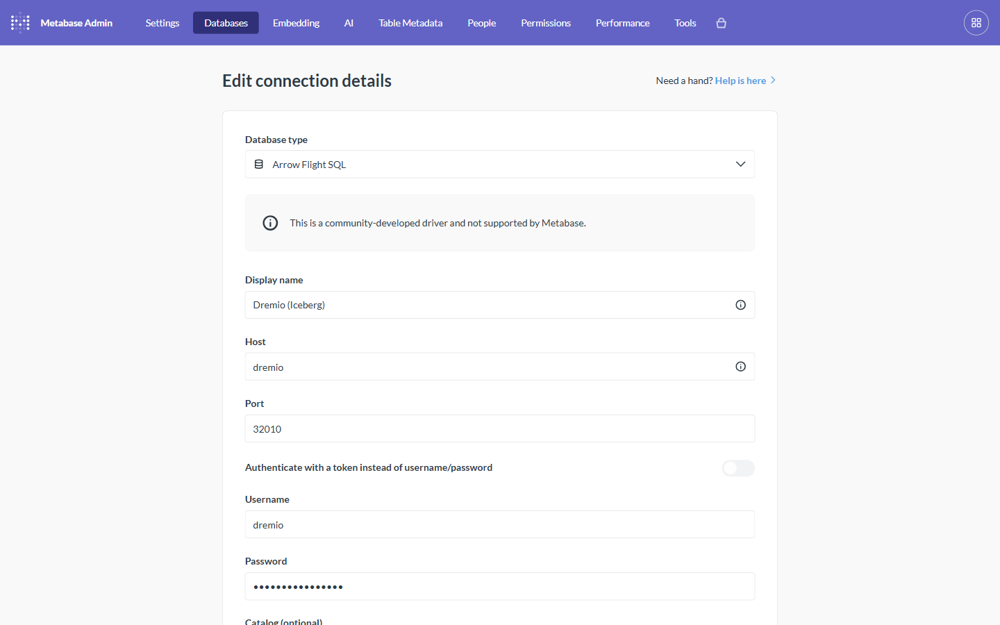
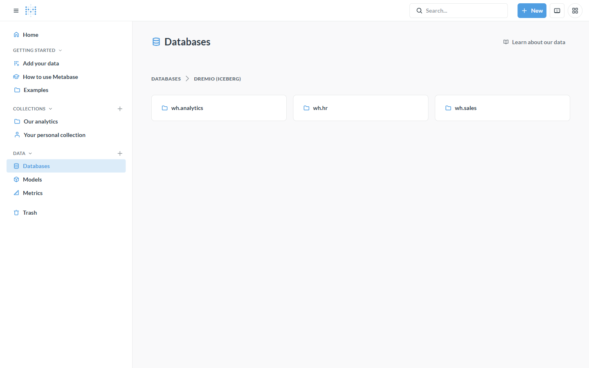
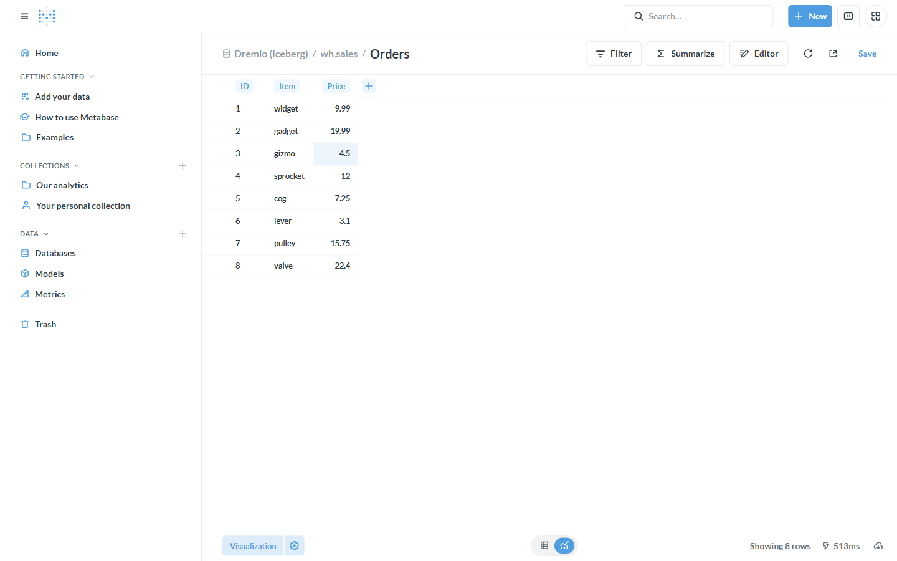
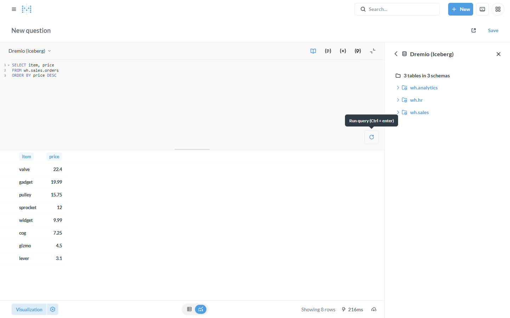
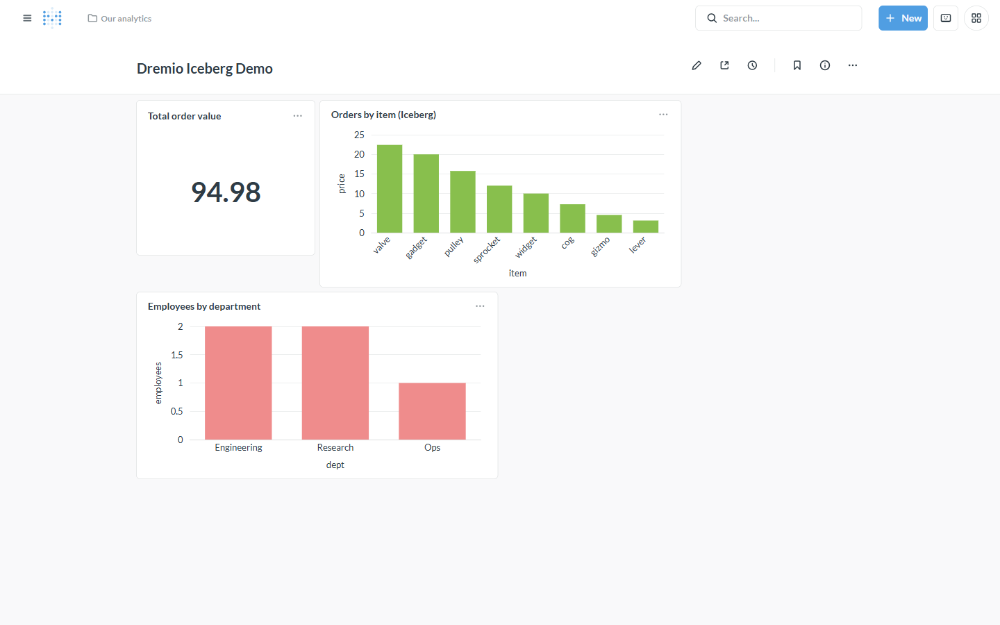
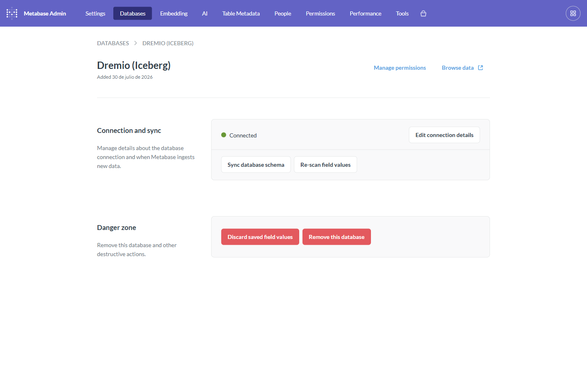

# Tutorial: An Apache Iceberg lakehouse in Metabase

**Backend:** Dremio (OSS) · **Also works with:** Spice.ai, GizmoSQL ·
**Level:** intro · **Time:** ~15 min (mostly Dremio's first boot)

## Problem

You have (or want) an **Apache Iceberg** lakehouse and you want to explore,
query, and dashboard it in Metabase — without copying data into a warehouse
first. Metabase has no Iceberg driver. This driver gets you there by connecting
Metabase to a query engine that *does* speak Iceberg, over Arrow Flight SQL.

## When to use this

- Your tables live as Iceberg on object storage (S3/GCS/HDFS/local) and you want
  BI on them directly.
- You want **read and write** — Dremio writes Iceberg by default, so you can even
  create tables from Metabase.
- You want one BI surface over a lakehouse instead of per-source connectors.

> **Key idea:** the driver is pure transport. "Can Metabase read Iceberg?" is
> really "can the Flight SQL engine on the other end read Iceberg?" Dremio,
> Spice.ai, and GizmoSQL all can — so all of them give Metabase Iceberg, with no
> Iceberg-specific code in the driver.

## What you'll build

A Metabase connection to a Dremio lakehouse holding three Iceberg tables
(`wh.sales.orders`, `wh.hr.employees`, `wh.analytics.events`), then browse them,
query them with SQL, and assemble a dashboard.

## Prerequisites

The base stack running with the driver installed (see the
[main README](../../README.md#quick-start)), and Metabase reachable at
http://localhost:3000.

---

## Step 1 — Deploy Dremio + seed Iceberg tables

Bring up the Dremio profile and run its setup script:

```bash
podman-compose -f docker-compose.yaml -f docker-compose.dremio.yaml up -d dremio
python scripts/setup_dremio.py
```

`setup_dremio.py` bootstraps a Dremio admin (`dremio` / `dremio123`), adds a
writable **NAS source** `wh` backed by a named volume, and runs `CREATE TABLE …
AS SELECT` three times. Because Dremio's default table format for filesystem
sources is **Iceberg**, those three tables *are* Iceberg tables. It prints:

```
CTAS wh.sales.orders: ok
CTAS wh.hr.employees: ok
CTAS wh.analytics.events: ok
wh.sales.orders row count: 8
Dremio ready: host=dremio port=32010 (Arrow Flight SQL), user=dremio, pass=dremio123
```

Dremio wants ~4 GB RAM and takes 1–2 minutes to first boot. Its web console is at
http://localhost:9047 if you want to look around.

## Step 2 — Connect Metabase to Dremio

In Metabase go to **Admin → Databases → Add database** and pick **Arrow Flight
SQL**. Fill in:

| Field | Value |
|---|---|
| Display name | `Dremio (Iceberg)` |
| Host | `dremio` |
| Port | `32010` |
| Username | `dremio` |
| Password | `dremio123` |

Leave the token toggle off and TLS off for the local demo.



Save. Metabase runs a connection test and then syncs the schema.

## Step 3 — Browse the Iceberg tables

Open **Browse data → Dremio (Iceberg)**. Dremio's nested folders surface as
schemas, so you see `wh.sales`, `wh.hr`, and `wh.analytics` — one per Iceberg
namespace.



## Step 4 — Explore a table

Click into **wh.sales → Orders**. Metabase shows the rows straight from the
Iceberg table — no import step.



## Step 5 — Query Iceberg with SQL

Click **＋ New → SQL query**, choose **Dremio (Iceberg)**, and run:

```sql
SELECT item, price
FROM wh.sales.orders
ORDER BY price DESC
```

The engine reads the Iceberg table and returns the rows — here, 8 rows in
216 ms. Dremio pushes filters and limits down toward the Iceberg scan, so this
scales well beyond the toy dataset.



## Step 6 — Build a dashboard

Save a few questions and drop them on a dashboard. This one has a scalar
(**total order value**) plus two bar charts (**orders by item**, **employees by
department**) — every card backed by a live Iceberg query.



> Tip: for chart cards, set the X/Y explicitly (bar/line charts want
> `graph.dimensions` / `graph.metrics`) so Metabase doesn't prompt "which fields
> for the X and Y axes?".

## Step 7 — Verify sync & refresh metadata

Back in **Admin → Databases → Dremio (Iceberg)** the connection shows
**Connected**, with **Sync database schema** and **Re-scan field values** — use
these after you add or change Iceberg tables so Metabase picks them up.



---

## How it works

```
Metabase ──(arrow-flight-sql JDBC)──▶ Dremio ──▶ Apache Iceberg on object storage
   BI            this driver          engine          (Parquet + Iceberg metadata)
```

Metabase speaks to the driver like any SQL database; the driver speaks Arrow
Flight SQL to Dremio; Dremio does the Iceberg reads/writes. Nothing in the driver
knows what Iceberg is — swap Dremio for Spice.ai or GizmoSQL and Metabase reads
Iceberg through those instead.

## Variations & gotchas

- **Write to Iceberg from Metabase.** Dremio is writable — a native
  `CREATE TABLE wh.sales.my_table AS SELECT …` creates a new Iceberg table you
  can immediately query (drop it with `DROP TABLE …`). See
  [write-back / actions](writeback-actions.md).
- **Other Iceberg engines.** [Spice.ai](../backends/spice.md) reads Iceberg via
  its `iceberg:` catalog connector; [GizmoSQL](../backends/gizmosql.md) via
  DuckDB's `iceberg` extension. Same Metabase experience, different `Host`/`Port`.
- **Warehouse must be a named volume** (the compose profile handles this): a
  Windows host bind mount fails Dremio's Hadoop `setPermission()` on write.
- **Restarts re-run setup.** This profile persists the Iceberg *data* volume but
  not Dremio's metadata store, so after a restart re-run `scripts/setup_dremio.py`
  (it's idempotent).
- **PAT/Bearer auth is Enterprise-only** in Dremio OSS; use username/password
  here. See the [auth cookbook](auth-cookbook.md) for the token flow on other
  backends.

## Related

- Backend reference: [Dremio](../backends/dremio.md)
- [Federation / semantic layer](federation-semantic-layer.md) — Dremio over many sources
- [Caching / acceleration](caching-acceleration.md) — Spice.ai in front of a lakehouse
