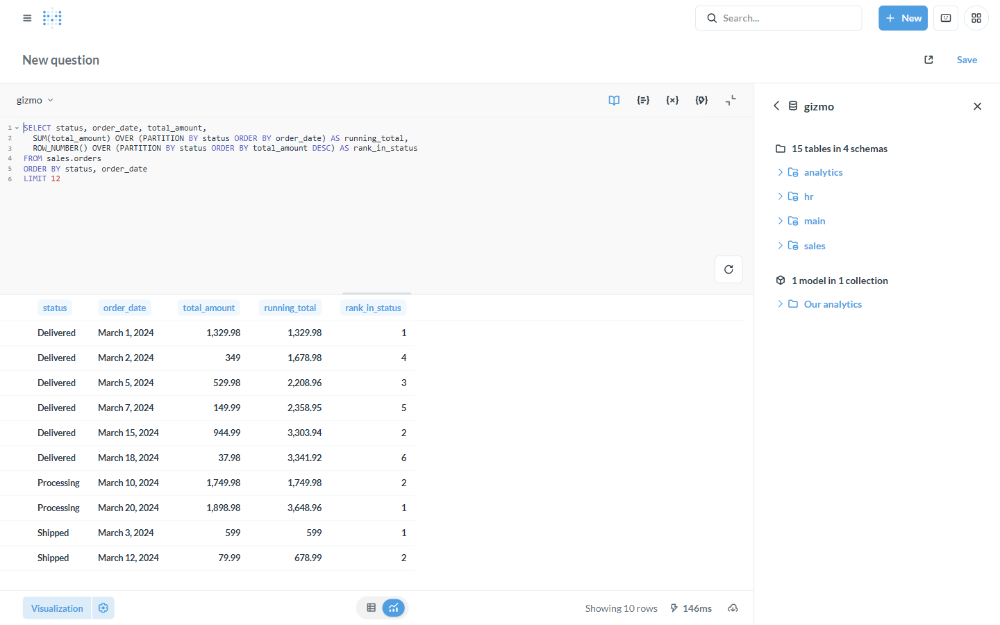

# Tutorial: Local / embedded analytics (no warehouse)

**Backend:** GizmoSQL (DuckDB) · **Also works with:** quack-on-demand (DuckLake) ·
**Level:** intro · **Time:** ~5 min

## Problem

You want fast analytical SQL over files (Parquet/CSV) or a lightweight embedded
engine — **without** provisioning a data warehouse. **GizmoSQL is DuckDB exposed
over Arrow Flight SQL**, so Metabase gets DuckDB's columnar engine, file readers,
and analytical SQL through this driver, with nothing to operate but one container.

## When to use this

- Analytics on Parquet/CSV/JSON sitting on disk or object storage, no warehouse.
- Local/dev/edge deployments where a full warehouse is overkill.
- You want DuckDB's rich SQL (window functions, `QUALIFY`, list/struct, `read_*`
  file functions, Iceberg/Delta readers) surfaced in Metabase.

## What you'll build

Connect Metabase to GizmoSQL and run DuckDB analytical SQL (window functions)
through the driver.

## Prerequisites

The base stack with a **GizmoSQL** connection ([backends/gizmosql](../backends/gizmosql.md)),
Metabase at http://localhost:3000.

---

## Step 1 — Connect

Add an **Arrow Flight SQL** database: host `gizmo­sql`, port `31337`, username
`gizmosql`, password `gizmosql_password`. That's the whole "warehouse" — one
DuckDB process serving Flight SQL.

## Step 2 — Run analytical SQL

DuckDB's full analytical SQL flows through the driver. Here, per-status running
totals and in-status ranking with window functions:

```sql
SELECT status, order_date, total_amount,
  SUM(total_amount) OVER (PARTITION BY status ORDER BY order_date) AS running_total,
  ROW_NUMBER() OVER (PARTITION BY status ORDER BY total_amount DESC) AS rank_in_status
FROM sales.orders
ORDER BY status, order_date
LIMIT 12
```



## Step 3 — Query files directly (no load step)

Because it's DuckDB, you can read files where they live — no ingest:

```sql
-- Parquet / CSV / JSON on local disk or object storage
SELECT * FROM read_parquet('/data/events.parquet') WHERE amount > 100;
SELECT category, COUNT(*) FROM read_csv_auto('/data/products.csv') GROUP BY category;

-- attach an Iceberg REST catalog or read Delta tables
ATTACH 'my_catalog' AS ice (TYPE iceberg);
SELECT * FROM delta_scan('s3://bucket/table');
```

Point these at paths mounted into the GizmoSQL container (or object-store URLs)
and Metabase queries them like tables — see [Iceberg lakehouse](iceberg-lakehouse.md)
for the catalog-managed variant.

---

## How it works

```
files / DuckDB tables ──▶ GizmoSQL (embedded DuckDB) ──(arrow-flight-sql)──▶ Metabase
   no warehouse                one process, Flight SQL          driver
```

DuckDB executes the query in-process against files or its own tables and streams
Arrow back over Flight SQL. The driver just carries it to Metabase.

## Variations & gotchas

- **DuckLake / multi-tenant.** [quack-on-demand](../backends/quack.md) serves a
  DuckLake (DuckDB lakehouse) over Flight SQL with per-tenant isolation — same
  DuckDB power, multi-tenant.
- **Extensions.** File/format support (httpfs, iceberg, delta, parquet) comes
  from DuckDB extensions bundled in the GizmoSQL image.
- **Writable.** GizmoSQL also does [uploads](csv-uploads.md) and
  [transforms](transformations-in-metabase.md) — it's not read-only.
- **`:memory:` vs file.** The demo runs an in-memory DuckDB; point
  `DATABASE_FILENAME` at a `.duckdb` file to persist across restarts.

## Related

- Backend reference: [GizmoSQL](../backends/gizmosql.md) · [quack-on-demand](../backends/quack.md)
- [CSV uploads](csv-uploads.md) · [Iceberg lakehouse](iceberg-lakehouse.md)
