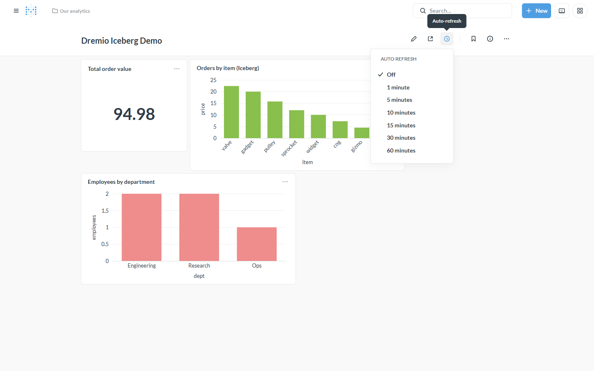

# Tutorial: Real-time analytics

**Backends:** Spice.ai (CDC / append) · Doris/StarRocks (streaming OLAP) ·
**Level:** intermediate · **Time:** ~10 min

## Problem

You want dashboards that reflect **fresh** data — a metric that moves as orders
come in, an ops board that tracks the last few minutes. Real-time analytics needs
two things working together: **fresh data at the backend**, and **Metabase
showing it without a manual reload**. This driver connects Metabase to Flight SQL
engines that specialize in the first; Metabase's dashboard auto-refresh handles
the second.

## When to use this

- Live operational dashboards (orders, sessions, sensors, KPIs).
- A source that changes continuously (a transactional DB via CDC, a Kafka stream).

## The freshness chain

```
source changes ──▶ backend keeps a fresh copy ──(arrow-flight-sql)──▶ Metabase ──▶ dashboard auto-refresh
  (CDC / stream)     Spice append/CDC · Doris routine-load        driver          re-runs every N minutes
```

Every link has to be as fresh as the slowest one — tune them together.

## Step 1 — Keep the data fresh at the backend

**Spice.ai** — accelerate with `refresh_mode: append` for incremental pulls, or a
CDC-capable connector (e.g. Debezium) for near-real-time change capture:

```yaml
datasets:
  - name: orders
    from: debezium:orders          # or postgres: with refresh_mode: append
    acceleration:
      enabled: true
      engine: duckdb
      refresh_mode: append          # add new rows instead of full reload
      refresh_check_interval: 30s
```

**Doris / StarRocks** — real-time OLAP built for streaming ingest (Stream Load /
Routine Load from Kafka) plus fast aggregation queries; Metabase reads the live
tables over Flight SQL. See [backends/doris-starrocks](../backends/doris-starrocks.md).

## Step 2 — Serve it over Flight SQL

Point Metabase at the engine as usual (Spice: host `spiced-container` : `50051`).
Metabase queries the continuously-updated tables — no export step.

## Step 3 — Make the dashboard live

On any dashboard, open **Auto-refresh** (the clock icon) and pick an interval —
1, 5, 10, … minutes. Metabase re-runs the cards on that cadence, so the board
tracks the backend:



For a wall display, combine it with full-screen (the ⤢ icon).

---

## How it works

The backend does the hard part — capturing changes and keeping a query-ready copy
current. The driver streams the latest rows to Metabase on each run, and the
dashboard's auto-refresh decides how often "each run" happens. Nothing is
pre-computed or stale beyond the intervals you set.

## Variations & gotchas

- **Match the intervals.** A 1-minute dashboard refresh over a 30-minute Spice
  refresh is *not* real-time — the dashboard just re-reads stale data. Make the
  Metabase interval ≥ the backend refresh cadence, and shorten both for freshness.
- **Watch result caching.** If you enabled [result caching](caching-acceleration.md),
  a long cache TTL will defeat auto-refresh — keep the TTL ≤ the refresh interval.
- **`append` vs `full`.** `append` is cheaper and lower-latency but assumes
  immutable/rolling data; `full` is simpler but heavier. CDC connectors handle
  updates/deletes properly.
- **Doris/StarRocks in containers.** Their real-time OLAP is great, but the
  all-in-one images have a Flight SQL endpoint-advertisement limit from a separate
  Metabase container — see [backends/doris-starrocks](../backends/doris-starrocks.md).
- **Load matters.** Frequent auto-refresh × many viewers = many backend queries;
  an acceleration/cache layer absorbs that.

## Related

- [Caching / acceleration](caching-acceleration.md) — the same Spice layer, refresh-tuned
- Backend references: [Spice.ai](../backends/spice.md) · [Doris/StarRocks](../backends/doris-starrocks.md)
