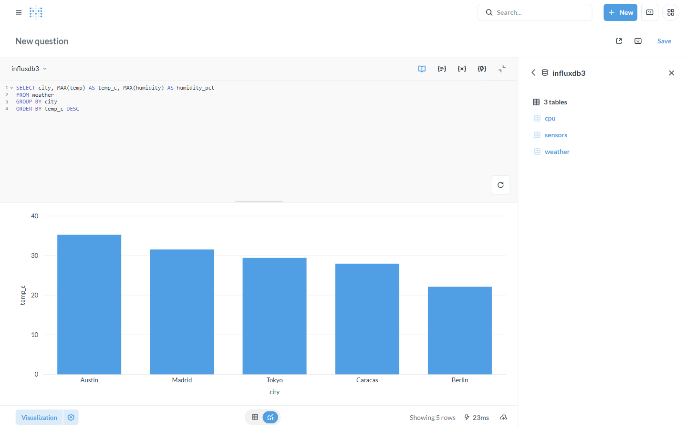

# Tutorial: Time-series analytics

**Backend:** InfluxDB 3 (Core) · **Level:** intro · **Time:** ~5 min

## Problem

You have time-series data — metrics, IoT/sensor readings, events — and you want
to explore and dashboard it in Metabase. **InfluxDB 3** speaks Arrow Flight SQL,
so this driver connects Metabase straight to it, with SQL (not Flux/InfluxQL).

## When to use this

- Metrics/observability, sensor/IoT, or any measurement-over-time data.
- You want SQL + Metabase dashboards over InfluxDB instead of a bespoke UI.

## What you'll build

Connect Metabase to InfluxDB 3 and chart weather measurements; the recipe extends
to time-bucketed trends.

## Prerequisites

The base stack. Bring up and seed InfluxDB 3:

```bash
podman-compose up -d influxdb3
python scripts/setup_influxdb3.py     # creates an admin token → .env, loads sample data into `demo`
```

See [backends/influxdb3](../backends/influxdb3.md).

---

## Step 1 — Connect (bearer token + database header)

Add an **Arrow Flight SQL** database:

| Field | Value |
|---|---|
| Host | `influxdb3` |
| Port | `8181` |
| Authenticate with a token | **on** |
| Bearer token / PAT / API key | the `INFLUXDB3_TOKEN` from `.env` |
| Additional options | `database=demo` |

`database=demo` is **required** — InfluxDB 3 picks the database from a gRPC header,
and the driver forwards unknown Additional-options as headers.

## Step 2 — Measurements are tables

After sync, each InfluxDB *measurement* shows up as a table — here `weather`,
`cpu`, and `sensors`. Query them with plain SQL:

```sql
SELECT city, MAX(temp) AS temp_c, MAX(humidity) AS humidity_pct
FROM weather
GROUP BY city
ORDER BY temp_c DESC
```



## Step 3 — Real time-series with time buckets

For trends over time, bucket the `time` column with `date_bin` and chart it as a
line — Metabase treats the time bucket as the x-axis:

```sql
SELECT date_bin(INTERVAL '1 hour', time) AS bucket,
       city,
       AVG(temp) AS avg_temp
FROM weather
GROUP BY bucket, city
ORDER BY bucket
```

Set the visualization to **Line**, dimension = `bucket`, series = `city`.

---

## How it works

```
InfluxDB 3 (measurements) ──(Flight SQL, Bearer + database=… header)──▶ Metabase
   time-series store              this driver forwards the header
```

InfluxDB 3's query engine (DataFusion) serves SQL over Flight SQL; the driver adds
the bearer token and the `database` header and streams Arrow back to Metabase.

## Variations & gotchas

- **Exclude `system`.** Add a schema-filters *exclusion* for `system` so
  InfluxDB's internal tables stay out of sync; your measurements live in `iox`.
- **Read-only from Metabase.** Writes use InfluxDB line protocol over HTTP, not
  SQL — so uploads/transforms don't apply here.
- **One database per connection.** `database=` is fixed per connection; add
  another Metabase database entry for a second InfluxDB database.
- **No catalog.** Leave the Catalog field blank; scope with `database=` only.

## Related

- Backend reference: [InfluxDB 3](../backends/influxdb3.md)
- [Real-time analytics / CDC](realtime-analytics.md) · [Auth cookbook](auth-cookbook.md)
