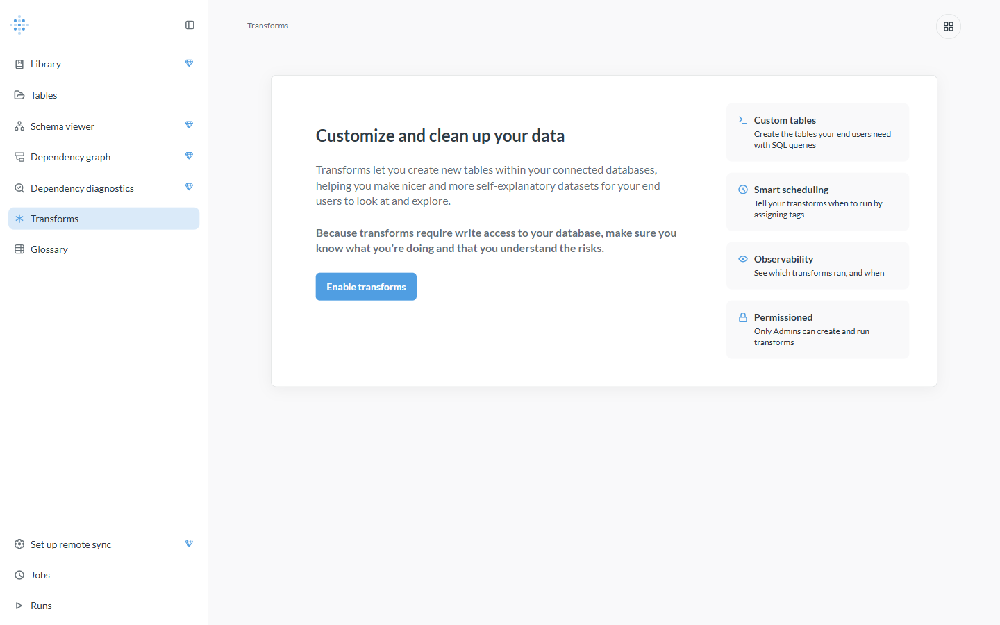
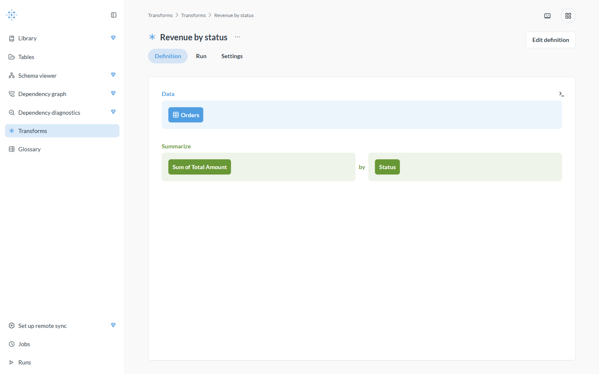
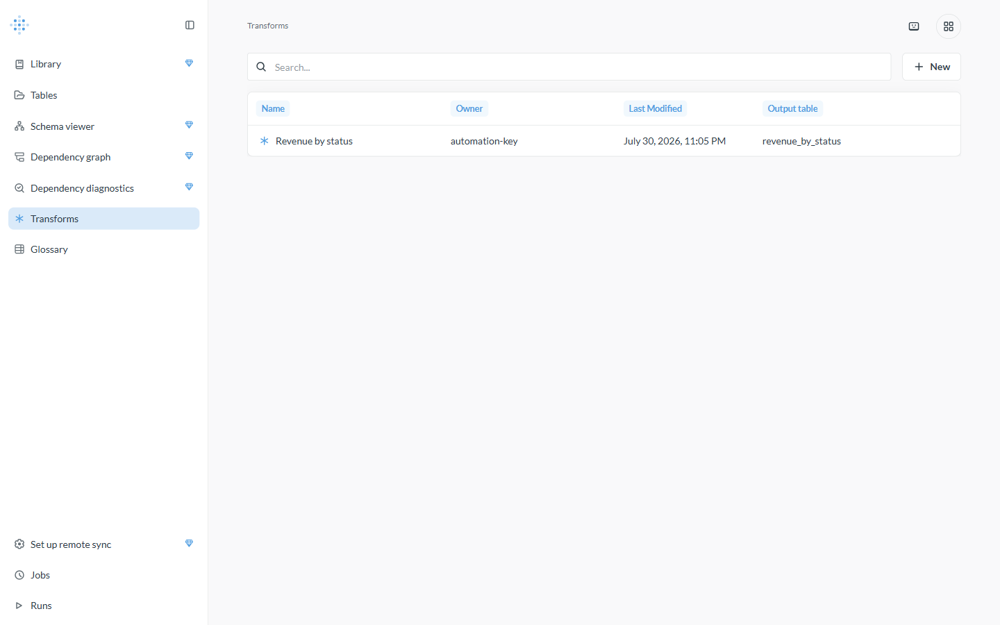
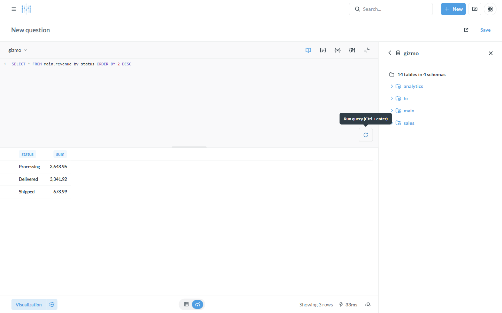

# Tutorial: Transformations inside Metabase

**Backend:** GizmoSQL (DuckDB) · **Also works with:** Dremio, Doris/StarRocks ·
**Level:** intro · **Time:** ~10 min

## Problem

You want to **reshape and materialize** data — roll up orders into a revenue
summary, clean a messy table, pre-join for your end users — without standing up
a separate ETL tool. Metabase's **Transforms** (Data Studio) run a saved query as
`CREATE TABLE AS` **on the warehouse itself**, and through this driver they work
against any *writable* Flight SQL backend.

## When to use this

- You want tidy, self-explanatory tables for end users instead of raw source tables.
- You want to materialize an expensive aggregate once and dashboard the result.
- Your backend accepts DDL/DML over Flight SQL (GizmoSQL/DuckDB, Dremio, Doris).

> Transforms **write** to your database, so they're gated by the same
> per-connection **Writable backend** toggle as CSV uploads — read-only backends
> (Spice datasets, InfluxDB 3) never appear as a transform target.

## What you'll build

A transform that turns `sales.orders` into a **revenue-by-status** table, runs it,
and produces a new queryable table `main.revenue_by_status`.

## Prerequisites

The base stack running with a **GizmoSQL** connection (see
[backends/gizmosql](../backends/gizmosql.md)), and Metabase at http://localhost:3000.

---

## Step 1 — Make the connection writable

In **Admin → Databases → gizmo → Edit connection details**, turn on
**"Writable backend (enable CSV uploads)"** and save. This is what makes the
connection advertise the `transforms/table` feature — without it, gizmo won't
appear in Data Studio's compatible-database list.

## Step 2 — Enable Transforms

Open **Data Studio → Transforms**. Because transforms write to your database,
Metabase asks you to explicitly enable them.



Click **Enable transforms**.

## Step 3 — Define a transform

Click **＋ New** and build the query that produces your table. Here: source
**Orders**, then **Summarize → Sum of Total Amount, grouped by Status**. Set the
**target** to a new table named `revenue_by_status`.



You can define the source as the visual query builder (shown) or as raw SQL.

## Step 4 — Run it

Run the transform. It executes as `CREATE TABLE main.revenue_by_status AS …` on
GizmoSQL. The transforms list shows it with its **output table** and last-run time.



## Step 5 — Query the output table

The transform created a real table in a new `main` schema. Sync the database (or
it appears automatically) and query it like any other table:

```sql
SELECT * FROM main.revenue_by_status ORDER BY 2 DESC
```



From here it's a normal Metabase table — chart it, add it to a dashboard, or use
it as the source for another transform.

---

## How it works

```
Saved query ──▶ Metabase Transform ──(CREATE TABLE AS via arrow-flight-sql)──▶ new table on the backend
```

A transform is a saved query plus a target. When it runs, Metabase issues a
`CREATE TABLE <target> AS <query>` over the driver; the backend does the write.
The feature only lights up on connections you've marked **writable**, so it's safe
by construction on read-only sources.

## Variations & gotchas

- **Writable backends only.** GizmoSQL/DuckDB, [Dremio](../backends/dremio.md)
  (writes Iceberg — the target table is an Iceberg table!), and
  [Doris/StarRocks](../backends/doris-starrocks.md) accept transforms. Read-only
  backends won't appear as a target — see [test coverage](../../tests/e2e/test_transforms.py).
- **Admins only.** Creating and running transforms is an admin-permissioned action.
- **Scheduling.** Assign tags and use **Jobs** to run transforms on a schedule;
  **Runs** shows the history (Data Studio left nav).
- **Uploads are the sibling feature.** The same writable toggle also enables CSV
  uploads — see [csv-uploads](csv-uploads.md).

## Related

- Backend reference: [GizmoSQL](../backends/gizmosql.md)
- [CSV uploads → typed model](csv-uploads.md)
- [Write-back / actions](writeback-actions.md)
