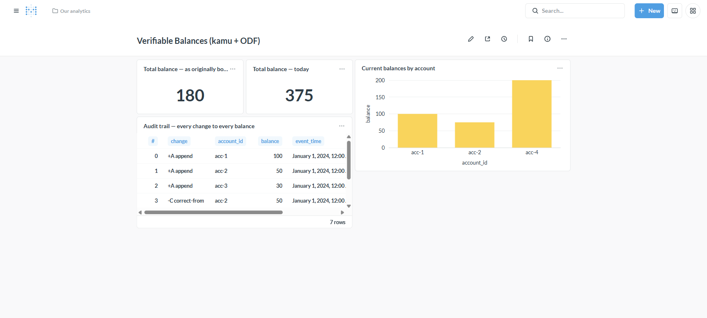
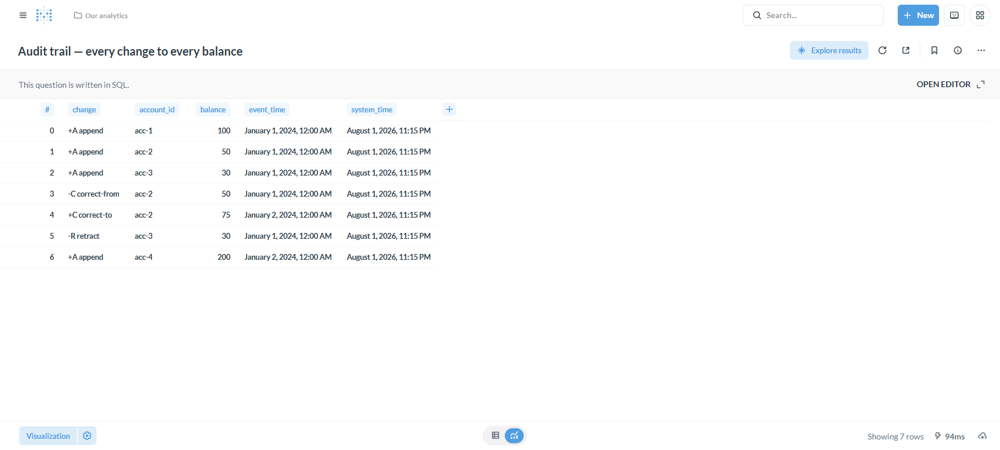

# Tutorial: Time-travel & audit-trail BI (verifiable data)

**Backend:** kamu / Open Data Fabric · **Level:** intermediate · **Time:** ~15 min

## Problem

A normal warehouse table only tells you the **current** value. But real questions
are often historical: *"What did this number look like last month?"*, *"Who
changed this figure, and when?"*, *"Can I prove today's dashboard wasn't quietly
edited?"* Answering those usually means bolting on slowly-changing-dimension
tables, CDC pipelines, and audit logging.

[kamu](../backends/kamu.md) makes them native. Every kamu dataset is an
**append-only changelog** rather than a mutable table: each row carries ODF
*system columns* — `op` (append/retract/correct), `system_time` (when the system
learned it) and `event_time` (when it happened). kamu speaks Arrow Flight SQL, so
this driver reads all of it straight into Metabase.



## When to use this

- Financial/regulatory data where **restatements and corrections must be auditable**.
- "As-of" reporting — reproduce the numbers as they stood on any past date.
- Any dataset where *how a value changed* matters as much as its current value.

> **kamu is read-only over SQL.** Data enters through kamu's ingest/transform
> pipeline, not SQL writes — so CSV uploads, transforms, and Actions don't apply
> here (unlike [GizmoSQL](../backends/gizmosql.md)/[Dremio](../backends/dremio.md)).

## Setup

```bash
podman-compose -f docker-compose.yaml -f docker-compose.kamu.yaml up -d kamu
```

The container seeds a `account.balances` dataset with two Snapshot batches, then
serves Flight SQL on `:50050`. Add it in Metabase (**Databases → Add → Arrow
Flight SQL**):

| Field | Value |
|---|---|
| Host / Port | `kamu` / `50050` |
| Username / Password | `anonymous` / `anonymous` |
| Use Encryption | off |
| Connect timeout (ms) *(advanced)* | `30000` |

After sync, `account.balances` appears with your fields (`account_id`, `balance`)
**plus** the ODF system columns `offset`, `op`, `system_time`, `event_time`.

> Use a **single, stable connection** — kamu's Flight SQL server is young and can
> get slow under bursts of new connections. Normal dashboard usage is fine.

## Step 1 — The current state (`to_table`)

kamu's changelog collapses to "current state" with the `to_table()` function.
A native query:

```sql
SELECT account_id, balance FROM to_table("account.balances") ORDER BY account_id;
```

returns the live balances (`acc-1 = 100`, `acc-2 = 75`, `acc-4 = 200`; total
**375**). This is what a normal BI table shows. Save it as a **bar chart** and a
**scalar** (`SELECT SUM(balance) FROM to_table("account.balances")`).

> `to_table()` takes a table **identifier** — double-quote dotted dataset names:
> `to_table("account.balances")`, not `'account.balances'`.

## Step 2 — The audit trail (the `op` changelog)

This is the part a warehouse can't do. Query the raw changelog and decode `op`:

```sql
SELECT offset AS "#",
       CASE op WHEN 0 THEN '+A append'
               WHEN 1 THEN '-R retract'
               WHEN 2 THEN '-C correct-from'
               WHEN 3 THEN '+C correct-to' END AS change,
       account_id, balance, event_time, system_time
FROM "account.balances"
ORDER BY offset;
```



Every change to every balance is here: `acc-2` was **corrected** `50 → 75` (a
`-C`/`+C` pair), `acc-3` was **retracted** (account closed), `acc-4` was
appended. `event_time` (Jan 2024) is *when it happened*; `system_time` (the
processing timestamp) is *when the system recorded it* — the two-clock
(bitemporal) model.

## Step 3 — Time-travel ("as of" a past state)

Because the log is append-only, you can reconstruct the state **as of any
transaction time** — no snapshot tables required. Per account, take the latest
change (by `offset`) up to a cutoff, keeping value-setting ops (`0` append, `3`
correct-to):

```sql
SELECT SUM(balance) AS total FROM (
  SELECT balance FROM (
    SELECT *, ROW_NUMBER() OVER (PARTITION BY account_id ORDER BY offset DESC) rn
    FROM "account.balances"
    WHERE system_time <= (SELECT MIN(system_time) FROM "account.balances")
  ) WHERE rn = 1 AND op IN (0, 3)
);
```

That "as originally booked" total is **180**. Today it's **375**. The two scalar
cards side by side tell the story instantly — and the audit trail in Step 2
*explains the entire €195 delta*: `+25` correction, `−30` closure, `+200` new
account. Swap the `MIN(system_time)` subquery for a `{{as_of}}` datetime filter to
make it an interactive time-travel control.

## How it works

```
kamu dataset = append-only changelog (offset, op, system_time, event_time, …)
   │                                   │                         │
   ├─ to_table(...) ── current state ──┤                         │
   ├─ WHERE system_time <= cut ── time-travel (as-of) ───────────┤
   └─ op decoded ── audit trail ───────────────────────────────► Metabase
                    (Arrow Flight SQL · DataFusion · no driver changes)
```

kamu serves DataFusion over Arrow Flight SQL, so the driver treats it like any
other Flight SQL source — the "magic" is entirely in ODF's changelog data model,
which the driver faithfully surfaces (system columns and all). Covered by
[test_kamu.py](../../tests/e2e/test_kamu.py).

## Going further — provable numbers

kamu can return, alongside a query result, a **cryptographically signed
commitment** (hashes of the input query + output + sub-queries, Ed25519-signed by
the node) via its REST query API. That lets a consumer *re-execute and prove* an
untrusted publisher computed a dashboard's numbers correctly — "trust-but-verify"
BI. It's out of band of the Flight SQL path, but it's the natural next step once
your dashboards live on verifiable, reproducible data. See
[kamu's commitments docs](https://docs.kamu.dev/node/commitments/).

## Variations & gotchas

- **Read-only.** No writes/uploads/transforms/Actions over SQL.
- **Single stable connection** — avoid connection churn against kamu's Flight SQL server.
- **Double-quote dotted dataset names** in SQL and in `to_table(...)`.
- **Reconstruct with `system_time`**, not `event_time`, for correct as-of state
  (a Snapshot correction carries the *old* value's `event_time` on its
  `correct-from` row).
- The demo workspace is ephemeral — restarting the container re-seeds it.

## Related

- Backend reference: [kamu](../backends/kamu.md)
- [Real-time / CDC analytics](realtime-analytics.md) · [Federation & semantic layer](federation-semantic-layer.md)
