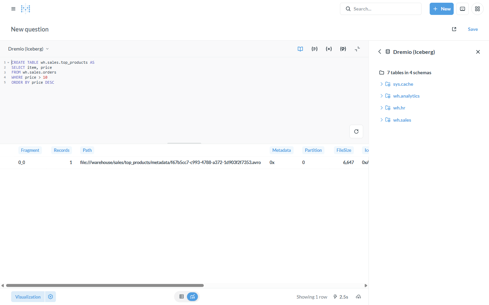
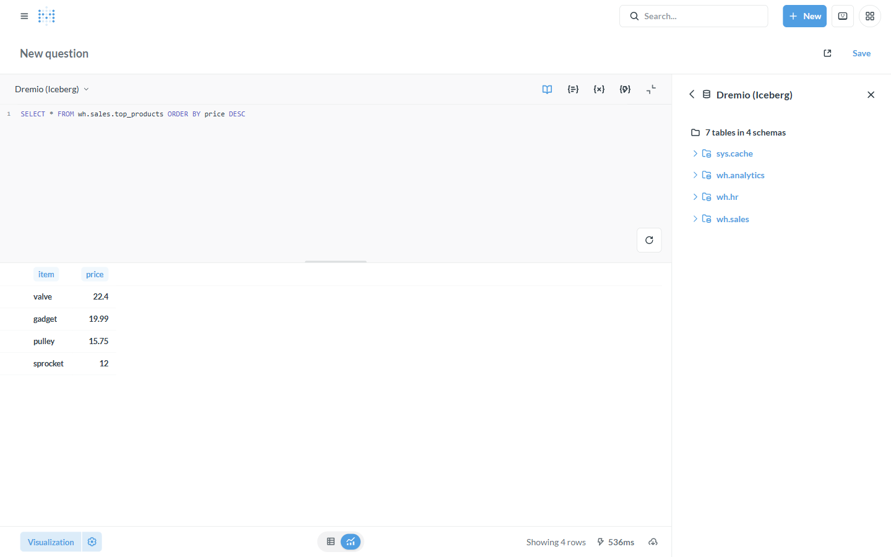

# Tutorial: Write-back to your lakehouse

**Backend:** Dremio (writes Iceberg) · **Also works with:** GizmoSQL, Doris/StarRocks ·
**Level:** intermediate · **Time:** ~10 min

## Problem

You want Metabase not just to *read* but to **write** — materialize a curated
table, snapshot a result, persist a derived dataset — back to your warehouse or
lakehouse. On a writable Flight SQL backend, this driver carries the DDL/DML, and
on **Dremio the written table is Apache Iceberg**.

## When to use this

- Persist a derived/curated table for downstream use (`CREATE TABLE AS`).
- Snapshot or append results on a cadence (pair with [transforms](transformations-in-metabase.md)).
- Build write-heavy flows on a lakehouse without leaving your BI tool.

> **Two flavors of write-back:** this page covers **SQL-level writes**
> (CTAS/`INSERT`/DDL) plus [transforms](transformations-in-metabase.md). For
> **row-level buttons & forms** (create/edit/delete a row from a dashboard), the
> driver also supports Metabase **Actions** on full-DML backends — see the
> [CRUD app tutorial](crud-app-gizmosql.md).

## What you'll build

Write a new Iceberg table on Dremio from a Metabase SQL query, then read it back.

## Prerequisites

A **Dremio** connection ([backends/dremio](../backends/dremio.md)), Metabase at
http://localhost:3000.

---

## Step 1 — Write with CREATE TABLE AS

In a native SQL question against **Dremio (Iceberg)**, run:

```sql
CREATE TABLE wh.sales.top_products AS
SELECT item, price
FROM wh.sales.orders
WHERE price > 10
ORDER BY price DESC
```

Dremio executes the write and returns the **Iceberg commit metadata** — note the
result row points at the new table's Iceberg manifest
(`file:///warehouse/sales/top_products/metadata/…​.avro`). The write created a
real Iceberg table, not a temp view:



## Step 2 — Read it back

It's a first-class table now — query, chart, or dashboard it:

```sql
SELECT * FROM wh.sales.top_products ORDER BY price DESC
```



Clean up when you're done: `DROP TABLE IF EXISTS wh.sales.top_products`.

## Step 3 — Other write patterns

- **`INSERT INTO … SELECT`** — append to an existing table.
- **[Transforms](transformations-in-metabase.md)** — schedule a saved query to
  materialize (and re-materialize) a table via Data Studio.
- **Doris/StarRocks** — DDL/DML with the MySQL dialect (`CREATE TABLE … DISTRIBUTED
  BY HASH(...)`), see [backends/doris-starrocks](../backends/doris-starrocks.md).

---

## How it works

```
Metabase SQL ──(CREATE TABLE AS / INSERT via arrow-flight-sql)──▶ Dremio ──▶ Apache Iceberg commit
```

The driver forwards the DDL/DML; Dremio performs the Iceberg write (new snapshot +
manifest) and reports the commit. Only connections marked **writable** accept these.

## Variations & gotchas

- **Row-level Actions** (dashboard buttons/forms) work too, on full-DML backends,
  behind the **Enable Actions** connection toggle — the driver inlines literals
  since Arrow Flight SQL JDBC can't bind statement parameters. See the
  [CRUD app tutorial](crud-app-gizmosql.md). Spice is INSERT-only, so its
  edit/delete actions won't work.
- **Writable backends only.** Dremio (Iceberg), GizmoSQL/DuckDB, Doris/StarRocks.
  Read-only backends (Spice datasets, InfluxDB 3) reject writes.
- **Iceberg semantics.** Each write is a new Iceberg snapshot — time-travel and
  schema evolution apply. Overwrites create new manifests, not in-place edits.
- **Permissions.** Restrict who can run DDL/DML via Metabase permissions + the
  backend's own RBAC (e.g. Dremio roles).

## Related

- [Iceberg lakehouse](iceberg-lakehouse.md) · [Transformations inside Metabase](transformations-in-metabase.md)
- Backend references: [Dremio](../backends/dremio.md) · [Doris/StarRocks](../backends/doris-starrocks.md)
